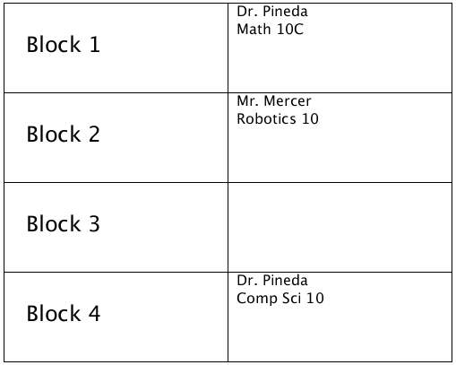

# CSE1110-assignment-4
In this assignment you are working with basic variables in Processing

You are to complete the following in one  file called ProcessingAssign3.  Be sure to run each part before moving on to the next.  As you go, add comments that give a title to each activity. You do NOT need to add any fonts or pictures to this document.  All colors are up to you.

This assignment has to be done on a Linux computer (e.g. Raspberry Pi). Before starting review how to use git on Linux.

## Set up
Make your display window 600 wide and 800 hight and plan on using the top  3/4 of the window for part 1 of the assignment.

## Part 1: Creating a time table
You are going to print the names and classes of three teachers.  To do this, follow  the steps below.

1. Store the names of all of your current teachers in separate strings called ```name1```, ```name2``` and ```name3```, etc.  Store the names of one of their courses additional Strings called ```course1```, ```course2``` and ```course3```, etc..  
2. Using lines or rectangles, set up a grid for a 1 day time table. This will essentially be a 2x4 table (or something similar) be sure to make the boxes big enough to fit in your course names. Colours are optional.
3. Use ```text()``` statements that use the above variables to print out the information into the time table. You may also add room numbers (optional). One possible layout is the following:



## Part 2: Bonus Challenge 1-3
Bonus Challenge 1-3 will be done in the lower 1/4 of the window.

### Bonus Challenge 1
Calculate the volume of air in this classroom in cubic feet. Each floor tile is exactly 1 foot square  (Yes, you have to count them.) and the ceiling is 12 feet high. To do this, follow  the steps below.

1. Use int variables called w, l and h to store the width, length and height. You can use a volume variable if you want or just do the math right in the text statement. Recall from your math class, ```volume = length * width * height```.
2. Print out your final statement such as: Room 215 contains approximately xxx cubic feet of air.

### Bonus Challenge 2
If you can calculate the volume of the room, it should be easy to calculate the square footage of the room. Imagine we are going to rip up the existing flooring and put in a fancier ceramic tile. The size of ceramic tile is 18 inches x 18 inches (18 inches = 1.5 feet).  Create a formula to calculate and then print the number of tiles that can fit in this room.  As long as your formula is approximately correct, I will give you credit.

### Bonus Challenge 3
For those of you who have mastered ‘basic variables’, you likely completed the above activities fairly quickly. To challenge yourself, see if you can work some IF STATEMENTS into the examples above. For example: IF (Semester==2), you have Math in block 1 - ELSE, you have Science

## Turn in your assignment
[Submitt your assignment for marking here](https://docs.google.com/a/epsb.ca/forms/d/e/1FAIpQLSdnnOUlwawWq9wmrKJZH40JlfNuSE8QaFGsJ_6OlzZle7m3MA/viewform)
